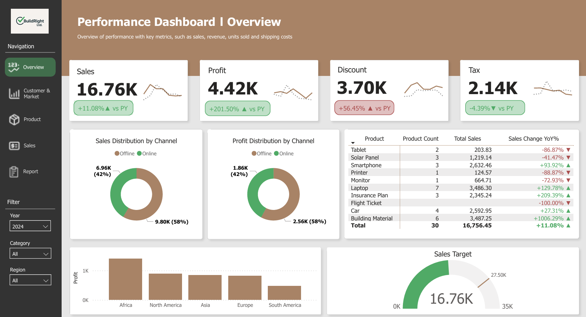
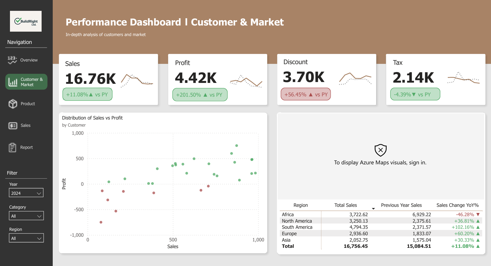
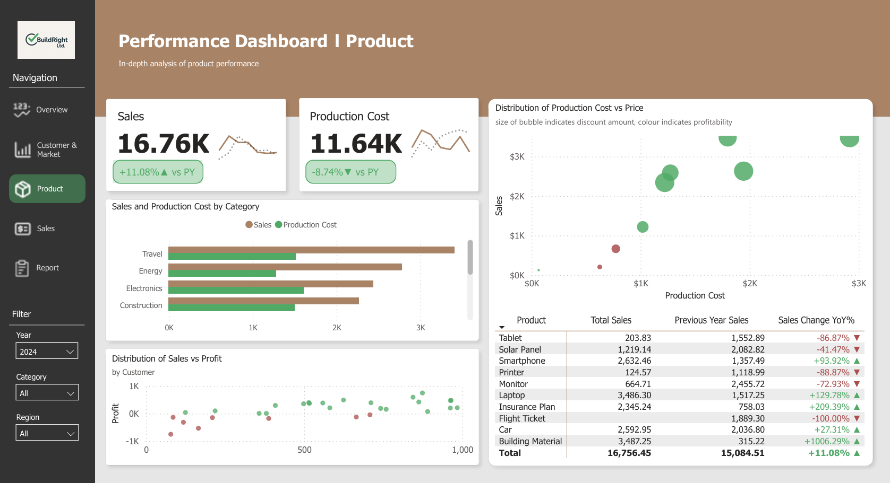
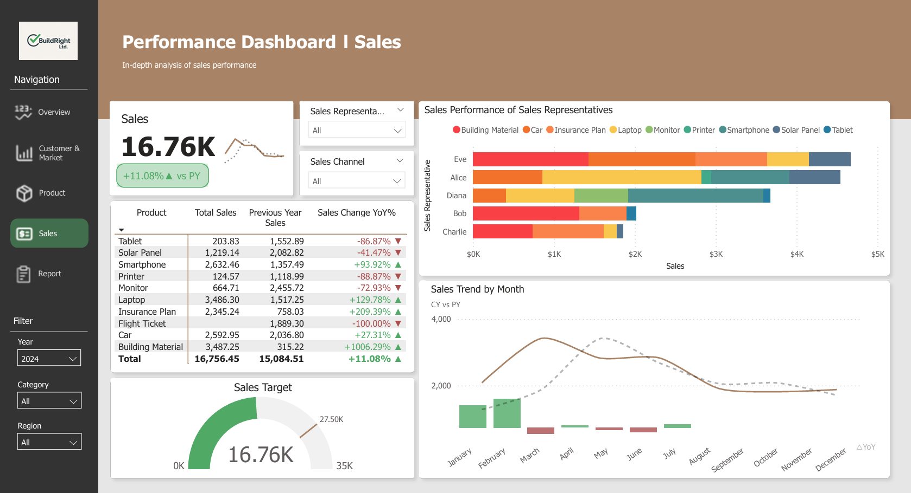
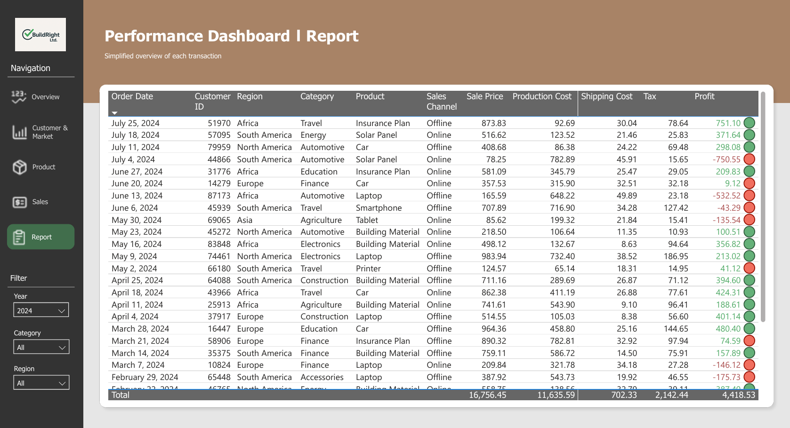

<style>
body {
  background-image: url('../../images/background.jpg');
  background-size: cover;
  background-position: center;
  background-attachment: fixed;
}
</style>

## Overview

This project involved building a multi-page Power BI dashboard for BuildRight Ltd., a fictional company selling products across five global regions. The dashboard provides insights into sales performance, customer distribution, product profitability, and sales team effectiveness.

## Dashboard Preview

::: {.callout-note}
The full interactive dashboard was built in Power BI. Below are screenshots of each page, followed by Python-based analysis recreating key insights.
:::











## Sales by Product

```{python}
import matplotlib.pyplot as plt

products = ['Building Material', 'Laptop', 'Smartphone', 'Car', 
            'Insurance Plan', 'Solar Panel', 'Monitor', 'Tablet', 'Printer']
sales = [3487.25, 3486.30, 2632.46, 2592.95, 
         2345.24, 1219.14, 664.71, 203.83, 124.57]

fig, ax = plt.subplots(figsize=(10, 5))
bars = ax.barh(products, sales, color='#5bcefa')
ax.set_xlabel('Sales ($)')
ax.set_title('Total Sales by Product (2024)')
ax.invert_yaxis()
for bar, val in zip(bars, sales):
    ax.text(bar.get_width() + 50, bar.get_y() + bar.get_height()/2, 
            f'${val:,.0f}', va='center', color='white')
plt.tight_layout()
plt.show()
```

## Year-over-Year Sales Change

```{python}
import matplotlib.pyplot as plt

products = ['Building Material', 'Insurance Plan', 'Laptop', 'Smartphone', 
            'Car', 'Solar Panel', 'Monitor', 'Tablet', 'Printer', 'Flight Ticket']
yoy_change = [1006.29, 209.39, 129.78, 93.92, 
              27.31, -41.47, -72.93, -86.87, -88.87, -100.00]
colors = ['#2ecc71' if x >= 0 else '#e74c3c' for x in yoy_change]

fig, ax = plt.subplots(figsize=(10, 5))
ax.barh(products, yoy_change, color=colors)
ax.set_xlabel('YoY Change (%)')
ax.set_title('Sales Change Year-over-Year by Product')
ax.axvline(x=0, color='white', linewidth=0.8)
ax.invert_yaxis()
plt.tight_layout()
plt.show()
```

## Regional Sales Performance

```{python}
import matplotlib.pyplot as plt

regions = ['South America', 'Africa', 'North America', 'Europe', 'Asia']
current = [4794.35, 3722.62, 3250.13, 2936.60, 2052.75]
previous = [2371.57, 6929.22, 2375.61, 1833.07, 1575.04]

x = range(len(regions))
width = 0.35

fig, ax = plt.subplots(figsize=(10, 5))
ax.bar([i - width/2 for i in x], current, width, label='2024', color='#5bcefa')
ax.bar([i + width/2 for i in x], previous, width, label='2023', color='#7c73ff')
ax.set_ylabel('Sales ($)')
ax.set_title('Regional Sales: 2024 vs 2023')
ax.set_xticks(x)
ax.set_xticklabels(regions)
ax.legend()
plt.tight_layout()
plt.show()
```

## Sales Channel Distribution

```{python}
import matplotlib.pyplot as plt

channels = ['Offline', 'Online']
sales = [9800, 6960]
colors = ['#5bcefa', '#7c73ff']

fig, ax = plt.subplots(figsize=(6, 6))
wedges, texts, autotexts = ax.pie(sales, labels=channels, colors=colors, 
                                   autopct='%1.0f%%', startangle=90,
                                   textprops={'color': 'white', 'fontsize': 14})
ax.set_title('Sales Distribution by Channel')
plt.tight_layout()
plt.show()
```

## Key Findings

- **Different KPI's and performance metrics could be identified through the creation of a PowerBI dashboard**